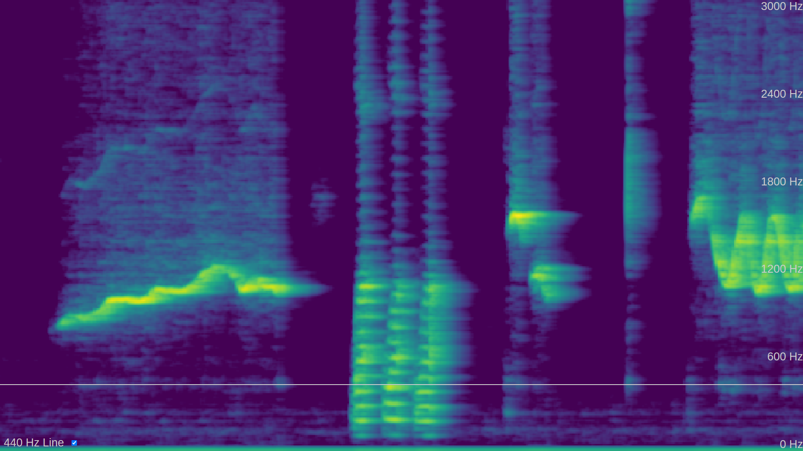

A real-time spectrogram running in the browser featured at [la Fête de la Science (2024)](https://www.ens-lyon.fr/evenement/savoirs/physique-decouvrir-comment-la-transformee-de-fourier-revele-les-secrets-caches)



# Online version

The spectrogram is running [at this URL](https://jeremyscanvic.com/spectrogram/)

# Local installation

Clone the repository

```bash
git clone https://github.com/jscanvic/spectrogram
cd spectrogram
```

Start an HTTP server in the current directory

```bash
python -m http.server -b 127.0.0.1 8000
```

Open [this URL](http://127.0.0.1:8000/) in a web browser

# Implementation details

The spectrogram is computed using the [Web Audio API](https://www.w3.org/TR/webaudio/) and more precisely using the [AnalyserNode](https://www.w3.org/TR/webaudio/#AnalyserNode) interface. It is continuously rendered onto an [HTMLCanvasElement](https://html.spec.whatwg.org/multipage/canvas.html#the-canvas-element). Every time a new section of the spectrogram is about to be rendered, everything else is shifted to the left before it is drawn on the newly available space. This is more computationally efficient than rendering the whole spectrogram at every frame and it enables real-time rendering at a higher temporal resolution.
